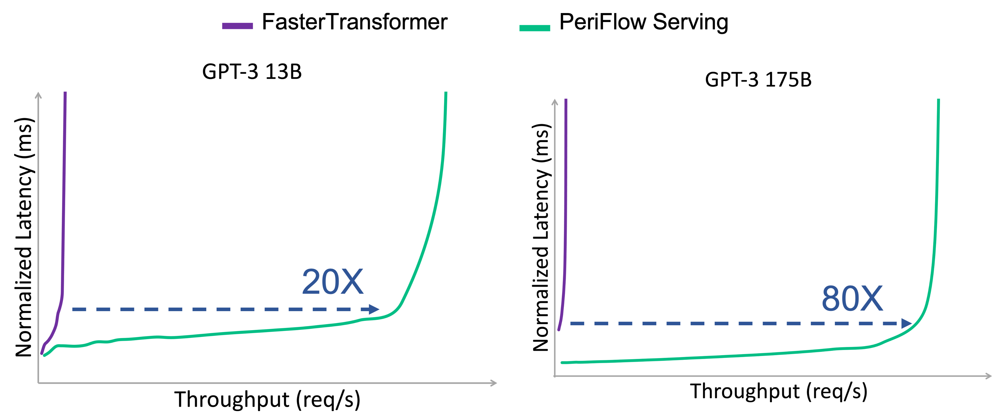

# GPT-FAI 13B
This repository introduces our GPT-FAI 13B model. GPT-FAI 13B is a GPT-3 model with 13 billion parameters, which is a large autoregressive language model pretrained by [FriendliAI](https://friendli.ai/).
GPT-FAI 13B is pretrained using [PeriFlow](https://friendli.ai/product), our service for training and serving large-scale AI models.
With PeriFlow, anyone can train large-scale models on hundreds of GPUs or more in the cloud easily. PeriFlow training is fast, thanks to our training optimization technologies and quickly and automatically handles various faults that may arise during training.

You can train and serve transformer models such as GPT-FAI 13B or bigger ones on PeriFlow. PeriFlow provides an optimized serving system that shows an order of magnitude higher performance than current state-of-the-art systems like NVIDIA [FasterTransformer](https://github.com/NVIDIA/FasterTransformer). If you are interested in PeriFlow, please contact us at (sales@friendli.ai).

Refer to the following sections for more details.
* [Pretrained Model](https://github.com/friendliai/FAI-Model/blob/main/README.md#pretrained-model)
* [Model Performance](https://github.com/friendliai/FAI-Model/blob/main/README.md#performance)
* [PeriFlow](https://github.com/friendliai/FAI-Model/blob/main/README.md#periflow)
* [Usage](https://github.com/friendliai/FAI-Model/blob/main/README.md#usage)
* [Ethics](https://github.com/friendliai/FAI-Model/blob/main/README.md#ethics)
* [Discussion](https://github.com/friendliai/FAI-Model/blob/main/README.md#discussion)
* [Citation](https://github.com/friendliai/FAI-Model/blob/main/README.md#citation)

## Pretrained Model
You can download the fp16 weights of GPT-FAI 13B from the following [link](https://forms.gle/PBqpHWAtZHXdYV9L6).
GPT-FAI 13B can be used solely for your non-commercial research purposes.

## Performance
We evaluated our model on various downstream tasks with [lm-evaluation-harness](https://github.com/EleutherAI/lm-evaluation-harness).
Note that our model is not fine-tuned to the downstream tasks, nor did we use any sophisticated prompt engineering. The following zero-shot results may not exactly represent the performance of our model.

|   Lambada   |  HellaSwag  | WinoGrande |     WSC     |  record    |    piqa     | openbookqa |
|------------|-------------|------------|-------------|------------|-------------|------------|
|      70.02 |       51.02 |      65.75 |       63.46 |      88.32 |       76.66 |       29.2 |


### PeriFlow 
We provide a fast inference serving system. The graphs below show a comparison of text generation latency and throughput between FasterTransformer and PeriFlow Serving on GPT-3 13B and GPT-3 175B models. We measure the latency and throughput under varying load to show the tradeoff between the two metrics.

We conducted the experiments on a single A100 40GB GPU for the 13B model and 16 A100 40GB GPUs for the 175B model. We used a synthesized trace of text generation requests for the experiments. Since each request in the workload requires different processing time, which is (roughly) proportional to the number of output tokens, latency is normalized by the number of output tokens of each request.

<p align="center">
  
</p>

PeriFlow significantly outperforms FasterTransformer, showing an order of magnitude higher throughput at the same level of latency. We plan to share more details in a few months. If you would like to use PeriFlow, please contact us at (sales@friendli.ai). 

## Usage
To make use of GPT-FAI 13B, you can load and run it on [NVIDIA FasterTransformer](https://github.com/NVIDIA/FasterTransformer), although it will be much slower than PeriFlow Serving.
Use our script below if you want to change the checkpoint format for an intra-layer parallelism degree to a value that is not 1 before running the model.

```bash
python scripts/covert_ft_ckpt.py -i <input directory> -o <output directory> -i_g <input intra-layer parallelism degree> -o_g <output intra-layer parallelism degree>
```

## Ethics
We trained GPT-FAI 13B on the Pile, a dataset that may contain inappropriate texts.
As we cannot predict the response to a "prompt" in advance, GPT-FAI 13B may produce socially unacceptable texts.
We recommend curating or filtering the outputs before releasing them, both to censor undesirable content and to improve the quality of the results.
You may refer to the ethical analysis of [the Pile](https://arxiv.org/abs/2101.00027) for more details.

## Discussion
If you have a question about GPT-FAI 13B, please use our [discussion forum](https://discuss.friendli.ai/c/fai-13b/7).

## Citation
If you use GPT-FAI 13B in your research, please cite:
```
@misc{FriendliAI2022gptfai13b,
  title         = {GPT-FAI 13B: FriendliAI's Generative Pre-trained Transformer 13B Model},
  author        = {FriendliAI},
  year          = {2022},
  howpublished  = {\url{https://github.com/friendliai/FAI-Model}},
}
```
